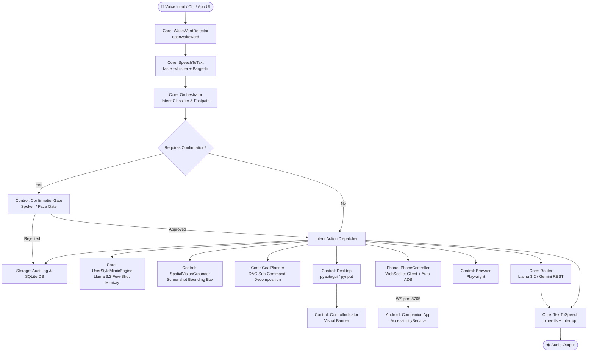

# ATLAS — Ultron AI Autonomous Voice Assistant & Control Engine

> **ATLAS** is a privacy-first, offline-capable autonomous voice assistant and control engine built in Python and Android Kotlin.  
> It understands natural language (Hindi + English code-switched), reasons locally via **Ollama (Llama 3.2)** or online via **Gemini**, and executes autonomous desktop, browser, and mobile actions with built-in safety confirmation gating.

---

## 🌟 Key Capabilities

- **Offline-First Voice Pipeline**: Offline wake-word detection (`openwakeword`), multi-lingual Speech-to-Text (`faster-whisper`), speech synthesis (`piper-tts`), and **full-duplex barge-in speech interruption**.
- **Dual AI Reasoning Engine**: Uses local **Llama 3.2** via Ollama by default; supports multimodal Gemini REST API for vision reasoning and multi-key fallback rotation.
- **Spatial Vision Grounding**: Locates UI elements by natural language description ("click the red Submit button") using Vision LLM bounding box prediction, and inspects screen for error stack traces (`control/vision_grounding.py`).
- **Desktop Control**: Native app launching, mouse clicking, text typing, screenshot capture, workspace file operations (`pyautogui`, `pynput`), and active control visual banner (`control/indicator.py`).
- **Browser Automation**: DOM-aware web navigation, search engine querying, form filling, and page text summarization (`playwright`).
- **Android Phone Ecosystem & Bridge**: High-speed WebSocket bridge connecting to an Android Accessibility Service (`atlas-phone-companion`), supporting tap, type, scroll, app launching, accessibility node tree reading, cross-device clipboard handoff, and incoming notification parsing.
- **Deep Learning User Style Mimicry**: Analyzes past user messages from `HistoryDB` and `user_style.json` to auto-reply to incoming chat/SMS messages matching the user's exact capitalization, punctuation, slang, brevity, and tone (`core/style_engine.py`, `phone/chat_auto_reply.py`).
- **Autonomous Goal Planner & Heartbeat**: Decomposes complex multi-step user prompts into sequential DAG execution plans (`core/agent_planner.py`) and runs periodic background monitoring tasks.
- **Self-Healing Automation & Voice Macros**: Automatically retries failed desktop/browser actions using Vision LLM re-location (`control/self_healing.py`) and executes custom voice macros ("Start Work Mode").
- **Cyberpunk HUD Overlay**: Lightweight status widget displaying active badges (`THINKING`, `EXECUTING`), visualizer waves, and execution log streams (`gui/hud.py`).
- **Safety Rails & Encryption**: Autonomous execution for non-destructive actions; mandatory confirmation gate for logins, payments, and deletions; Fernet-encrypted local face verification (`control/face_gate.py`) and OS Keyring keychain management (`core/credentials.py`).
- **Dual Storage & Audit**: Append-only JSONL audit trail (`storage/audit.jsonl`) + queryable SQLite database (`storage/history.db`).

---

## 🏗️ System Architecture & Data Flow



---

## 🎨 Dashboard & App Developer Specification

If you are building a **Desktop Application (Electron, Tauri, PySide), Web Dashboard (React, Next.js, Vue), or Mobile App (Flutter, React Native)** to control or monitor ATLAS, this section defines all data models, file paths, database schemas, and WebSocket payload formats.

---

### 1. Querying Command History (SQLite DB)
**File Location:** `storage/history.db`  
**Driver:** SQLite3 / `aiosqlite`

#### Table Schema (`history`):
```sql
CREATE TABLE history (
    id INTEGER PRIMARY KEY AUTOINCREMENT,
    timestamp DATETIME DEFAULT CURRENT_TIMESTAMP,
    raw_text TEXT NOT NULL,            -- Exact user command or transcript
    intent_type TEXT NOT NULL,         -- 'query', 'desktop_action', 'browser_action', 'phone_action', 'sensitive_action'
    route_used TEXT NOT NULL,          -- 'ollama', 'gemini', 'desktop_control_fastpath', 'phone_control', etc.
    response TEXT,                     -- Spoken response text or JSON result
    blocked BOOLEAN DEFAULT 0,         -- 1 if blocked/cancelled by confirmation gate, else 0
    latency_ms REAL,                   -- Round-trip execution latency in milliseconds
    metadata TEXT                      -- Extra JSON metadata dictionary
);
```

#### Recommended Dashboard SQL Queries:

- **Fetch Recent Activity Feed:**
  ```sql
  SELECT id, timestamp, raw_text, intent_type, route_used, response, blocked, latency_ms
  FROM history
  ORDER BY id DESC
  LIMIT 50;
  ```

- **Analytics: Action Breakdown by Intent Type:**
  ```sql
  SELECT intent_type, COUNT(*) as count, AVG(latency_ms) as avg_latency
  FROM history
  GROUP BY intent_type;
  ```

---

### 2. Live Telemetry & Audit Stream (JSONL)
**File Location:** `storage/audit.jsonl`  
Each line is an immutable, append-only JSON record emitted immediately after every action completes:

```json
{
  "ts": "2026-08-06T20:30:00.123456",
  "raw_text": "auto reply to John",
  "intent_type": "phone_action",
  "requires_confirmation": false,
  "route_used": "phone_control",
  "result": "{'status': 'ok', 'app': 'WhatsApp', 'sender': 'John', 'generated_reply': 'yep sounds good bro', 'sent': true}",
  "blocked": false,
  "latency_ms": 112.4
}
```

---

### 3. User Style Mimicry Repository (JSON)
**File Location:** `storage/user_style.json`  
Stores custom writing samples provided by the user for few-shot prompt conditioning:

```json
[
  "yep on it",
  "cool sounds good bro",
  "sure let me know when u arrive",
  "nah cant make it today"
]
```

---

### 4. Android Companion WebSocket API Contract
**Protocol:** Standard JSON over WebSocket  
**Target URI:** `ws://127.0.0.1:8765` (via ADB tunnel) or `ws://<phone-ip>:8765`

#### Client Requests → Android App:

| Action | Payload Schema | Description |
|---|---|---|
| **Tap Screen** | `{"action": "tap", "x": 540, "y": 960}` | Simulates touch tap at `(x, y)` |
| **Type Text** | `{"action": "type", "text": "Hello world"}` | Types text into currently focused input |
| **Scroll** | `{"action": "scroll", "direction": "down", "x": 540, "y": 960}` | Direction: `down`, `up`, `left`, `right` |
| **Open App** | `{"action": "open_app", "package": "com.whatsapp"}` | Launches Android application package |
| **Read Screen** | `{"action": "read_screen"}` | Returns active window accessibility node tree |

#### Android App Responses → Client:

- **Standard Action Response:**
  ```json
  { "status": "ok", "action": "tap" }
  ```

- **Read Screen Response:**
  ```json
  {
    "status": "ok",
    "elements": [
      {
        "text": "Send",
        "class": "android.widget.Button",
        "bounds": [900, 1800, 1080, 1920],
        "clickable": true
      }
    ]
  }
  ```

- **Incoming Notification Broadcast (Phone → Client):**
  ```json
  {
    "action": "notification",
    "app": "WhatsApp",
    "sender": "Alice",
    "body": "Hey, are you free for a call?"
  }
  ```

---

### 5. Cyberpunk HUD Overlay Contract (`gui/hud.py`)
**Method:** `hud.render_state()`

Returns state snapshot for binding to custom desktop UI widgets:

```json
{
  "visible": true,
  "badge": "EXECUTING",          // Statuses: 'OFFLINE', 'LISTENING', 'THINKING', 'EXECUTING', 'CONFIRMATION_WAIT'
  "logs": [
    "[20:44:01] Voice input: 'open chrome'",
    "[20:44:02] Fastpath: Launched Chrome on laptop",
    "[20:44:02] TTS: 'Opened Chrome on your laptop.'"
  ]
}
```

---

### 6. Intent Classification & Response Specs

| Intent Type | Example Command | Execution Handler | Response Payload Schema |
|---|---|---|---|
| `query` | *"What is general relativity?"* | `core/router.py` | `{"status": "ok", "route": "ollama", "response": "..."}` |
| `desktop_action` | *"Open Calculator"* | `control/desktop.py` | `{"status": "ok", "action": "open_app", "data": {...}, "response": "..."}` |
| `browser_action` | *"Search google for weather"* | `control/browser.py` | `{"status": "ok", "action": "search", "response": "...", "route": "browser_agent"}` |
| `phone_action` | *"Auto reply to John"* | `phone/chat_auto_reply.py` | `{"status": "ok", "generated_reply": "...", "sent": true, "response": "..."}` |
| `sensitive_action` | *"Delete file notes.txt"* | `control/confirmation.py` | `{"status": "cancelled", "reason": "not confirmed"}` OR `{"status": "ok", ...}` |

---

## ⚡ Quickstart Guide

### 1. Requirements & Prerequisites
- Python 3.11+
- [Ollama](https://ollama.com/) installed with `llama3.2` model (`ollama run llama3.2`)
- Android Phone (Android 9+) for phone bridge (optional)

### 2. Environment Setup
```bash
# Clone repository
git clone https://github.com/OmSinghBais/UltronAI.git
cd UltronAI

# Setup virtual environment
python3 -m venv .venv313
source .venv313/bin/activate
pip install -r requirements.txt
```

### 3. Run Automated Unit Test Suite
```bash
pytest tests/ -v
# 89 passed in 2.84s (100% pass)
```

### 4. Launch ATLAS Production Process
```bash
python main.py
```

---

## 📁 Repository Structure

```
UltronAI/
├── main.py                     # Unified long-running production entrypoint
├── requirements.txt            # Dependencies
├── .env.example                # Config template
├── ATLAS_MASTER_PROMPT.md      # Master architecture specification
├── PROGRESS.md                 # Project status tracker
├── config/
│   └── settings.py             # Pydantic environment configuration
├── core/
│   ├── orchestrator.py         # Main event loop & action dispatcher
│   ├── router.py               # Dual-engine LLM router (Llama 3.2 / Gemini REST)
│   ├── wake_word.py            # Offline openwakeword wrapper
│   ├── stt.py                  # faster-whisper transcriber
│   ├── tts.py                  # piper-tts speech generator + barge-in interrupt
│   ├── style_engine.py         # Few-shot user style mimicry engine
│   ├── agent_planner.py        # Multi-step DAG goal planner & heartbeat
│   ├── history_db.py           # aiosqlite SQLite interaction database
│   ├── audit_log.py            # Append-only JSONL logger
│   └── credentials.py          # OS Keyring keychain management
├── control/
│   ├── desktop.py              # Native mouse/keyboard/app automation
│   ├── browser.py              # Playwright web automation
│   ├── vision_grounding.py     # Spatial Vision element clicker & error inspector
│   ├── self_healing.py         # Vision-assisted action retries & voice macros
│   ├── confirmation.py         # Safety confirmation decorator
│   ├── face_gate.py            # Encrypted local face verification
│   └── indicator.py            # Active control visual banner
├── phone/
│   ├── bridge_server.py        # WebSocket client with auto ADB tunneling
│   ├── ecosystem.py            # Clipboard handoff & notification parser
│   └── chat_auto_reply.py      # Personalized chat auto-reply engine
├── gui/
│   └── hud.py                  # Cyberpunk HUD status widget manager
├── atlas-phone-companion/      # Android Kotlin Accessibility Service app
│   └── app/src/main/java/com/atlas/companion/
└── tests/                      # 89 automated unit tests (100% pass across 11 modules)
```

---

## 🛡️ License
MIT License. Built as an open-source autonomous AI assistant framework.